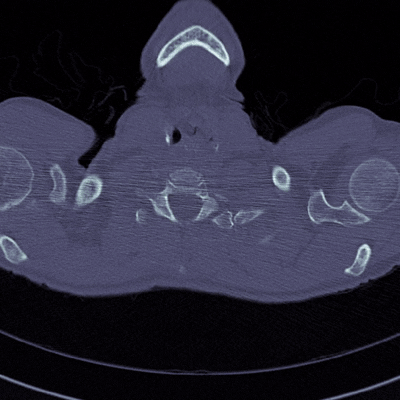
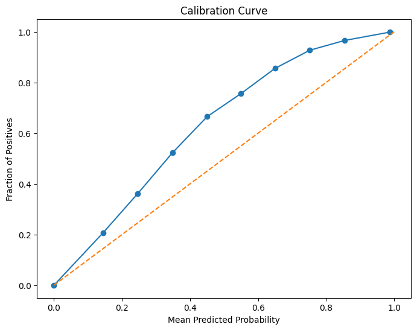
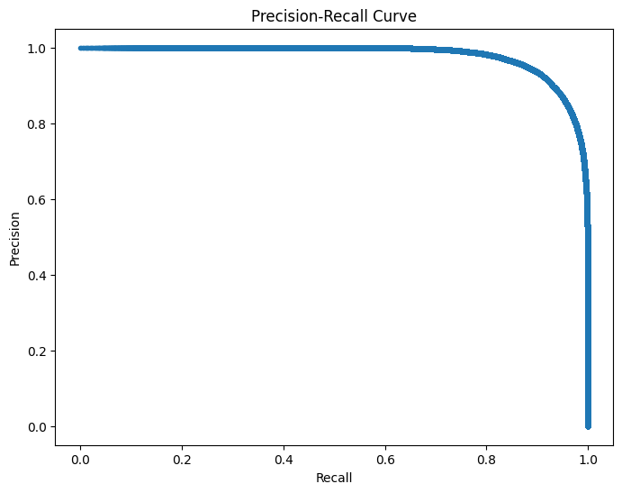
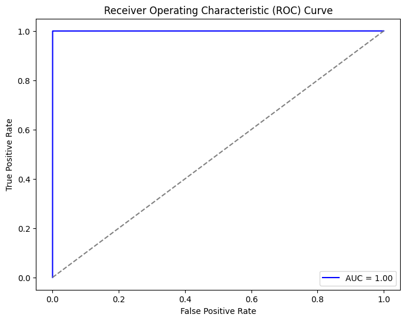
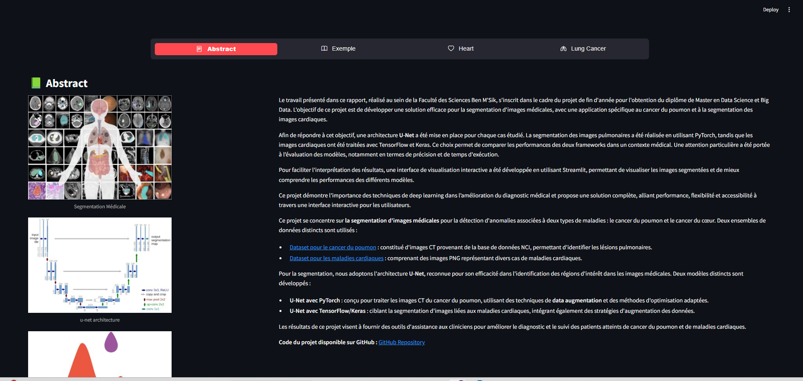
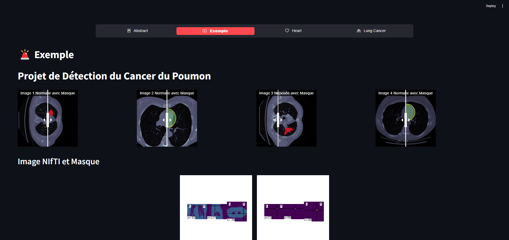
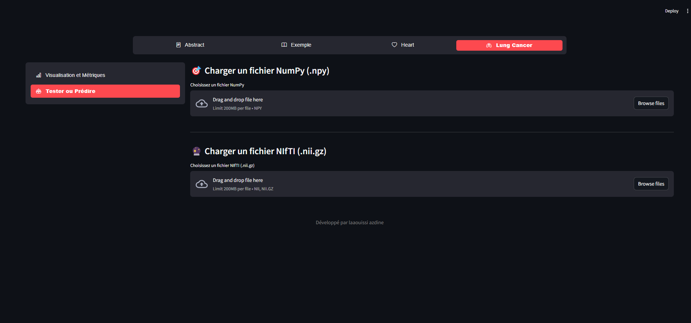
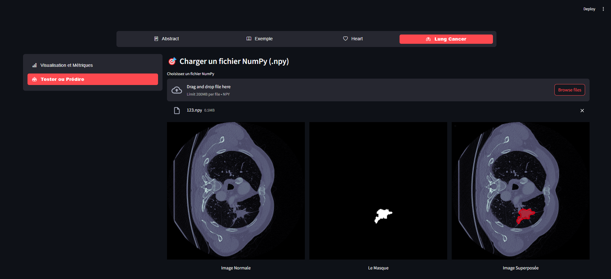
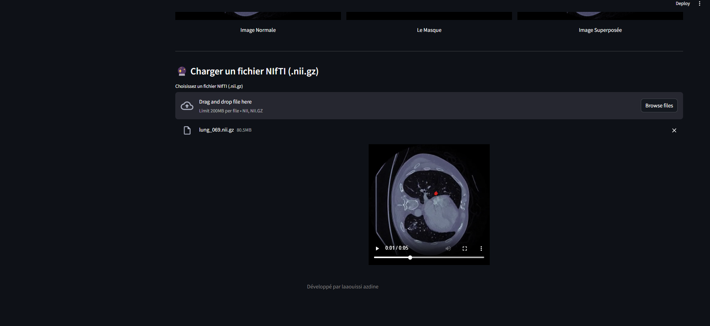
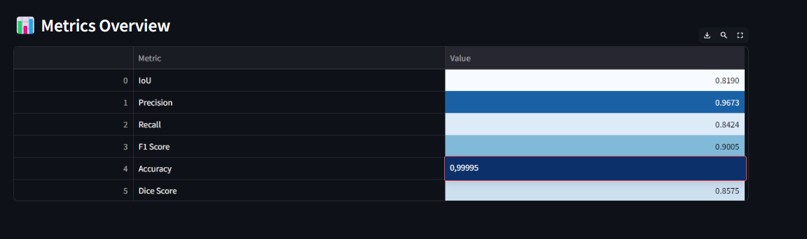

# 🏥 Segmentation d'Images Médicales pour le Diagnostic du Cancer du Poumon et des Maladies Cardiaques

## 📌 Description du Projet
Ce projet a été réalisé au sein de la **Faculté des Sciences Ben M'Sik** dans le cadre du projet de fin d'année pour l'obtention du **Master en Data Science et Big Data**. Il vise à développer une solution efficace pour la **segmentation d'images médicales**, avec une application spécifique sur :
- 🫁 **Le cancer du poumon**  
- ❤️ **Les maladies cardiaques**  

Nous avons utilisé **U-Net** comme architecture principale, en comparant **PyTorch** et **TensorFlow/Keras** pour la segmentation d'images.  

📊 Une interface interactive développée avec **Streamlit** permet la visualisation des résultats.

---

## 🚀 Objectifs
- Développer une solution de **segmentation d’images médicales** pour aider les cliniciens.  
- Comparer les performances de **PyTorch** et **TensorFlow/Keras** en termes de **précision et de rapidité**.  
- Offrir une interface utilisateur interactive pour faciliter l’interprétation des résultats.  

---

## 🖼️ Résultats Visuels
### 🔬 Segmentation Médicale
<div style="display: flex; justify-content: center; flex-direction: column; gap: 100px;">

<div style="display: flex; justify-content: center; gap: 100px;">
  
  
</div>
</div>

### 🏗️ Architecture du Modèle U-Net

<div style="display: flex; justify-content: center;">
  
</div>

### 📉 Courbes de Performance
<div style="display: flex; justify-content: center; flex-direction: column; gap: 2px;">
  <div style="display: flex; justify-content: center; gap: 2px;">
    
    
    
  </div>
</div>

---

## 📚 Données Utilisées
Deux ensembles de données ont été utilisés :

- **Cancer du poumon** 🫁 : [Dataset NCI](https://drive.google.com/drive/folders/1HqEgzS8BV2c7xYNrZdEAnrHk7osJJ--2)
- **Maladies cardiaques** ❤️ : [Dataset Kaggle](https://www.kaggle.com/datasets/nikhilroxtomar/ct-heart-segmentation)

---

## 🏗️ Méthodologie

### 🔹 Modèle utilisé : **U-Net**
Nous avons adopté **U-Net**, connu pour son efficacité dans la segmentation d’images médicales.

Deux implémentations ont été développées :
1. **U-Net avec PyTorch** : Pour la segmentation des images CT du cancer du poumon.  
2. **U-Net avec TensorFlow/Keras** : Pour la segmentation des images des maladies cardiaques.  

Les modèles ont été **entraînés avec data augmentation** et des **techniques d’optimisation adaptées**.

---

## 🎯 Performances des Modèles  

| 📊 **Métrique** | **Valeur** |
|--------------|--------|
| IoU (Intersection over Union) | 0.8190 |
| Précision | 0.9673 |
| Recall | 0.8424 |
| F1 Score | 0.9005 |
| Accuracy | 0.99995 |
| Dice Score | 0.8575 |

---

## 🖥️ Interface Utilisateur
Nous avons développé une interface interactive avec **Streamlit** qui permet de :
- **Charger des fichiers d’imagerie médicale** (`.npy`, `.nii.gz`).
- **Visualiser les prédictions en superposant les masques segmentés**.
- **Comparer les images normales et segmentées**.

### 📌 Exemple de Visualisation de l'Application Streamlit

**Page d'Accueil**  


**Visualisation des Résultats**  


**Chargement des Fichiers**  


**Affichage des Prédictions**  


**Superposition des Masques**  


**Analyse des Performances**  


---

## ⚙️ Installation et Exécution

### 🔽 1. Cloner le projet  
```bash
git clone https://github.com/azdinelaaouissi/PFA_SEG_CP.git
cd segmentation-medicale
```

### 📦 2. Installer les dépendances  
```bash
pip install -r requirements.txt
```

### 🚀 3. Lancer l'application Streamlit  
```bash
streamlit run app.py
```

---

## 📬 Contact  
📧 Email : laaouissi.azdine@gmail.com  
📌 GitHub : [Votre Profil](https://github.com/azdinelaaouissi)  

Si ce projet vous est utile, n’hésitez pas à laisser une ⭐ sur GitHub ! 🚀
